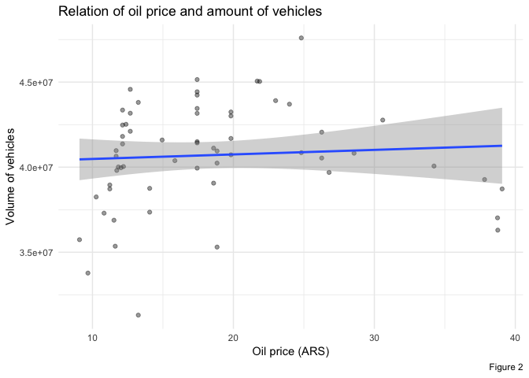
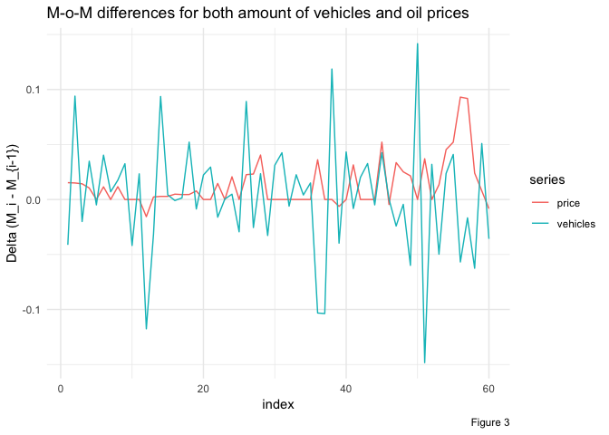
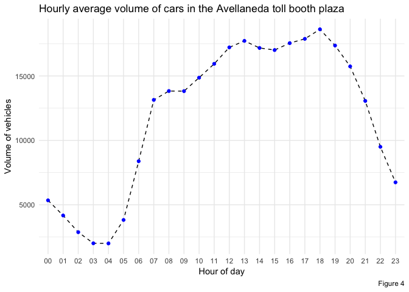

Estimation of time-spent on AUSA toll booths
================
Julián Ailán

-   [Objective](#objective)
-   [Joining the traffic dataset with the oil dataset](#joining-the-traffic-dataset-with-the-oil-dataset)
-   [Analysis of oil price behavior](#analysis-of-oil-price-behavior)
-   [Time spent waiting on queues estimation](#time-spent-waiting-on-queues-estimation)

### Objective

This project consists on estimating time-spent by drivers on AUSA toll booths in Buenos Aires highways. Currently users of these highways experience excessive amount of time waiting to go through toll booths on peak hours. In addition to estimating this metric, an analysis of whether contextual variables like toll-booth fee or oil prices have an impact on the behavior and amount of users commuting through these highways.

### Joining the traffic dataset with the oil dataset

The `traffic.csv` dataset previously analized [here](https://github.com/tulians/traffic/tree/master/descriptive) has a file size of approximately 562MB, while the `oil_prices.csv` dataset is only 11.2KB. We'll be merging both files in an inner join fashion, using the year and month columns via the [`merge()`](https://www.rdocumentation.org/packages/base/versions/3.6.0/topics/merge) function. As a result of this merge each existing row in `traffic.csv` will be repeated 4 times, one per each oil type, thus taking the final, merged, dataset to an approximate size of 2.2GB.

R requires that variables are stored in RAM in its entirety, so managing a dataframe this big could be imposible for some machines if no alternate processing is performed. For this reason is that the [`ff`](https://cran.r-project.org/web/packages/ff/index.html) package will be used.

### Analysis of oil price behavior

The oil prices dataset consists of monthly prices of different types of oil: super, premium, gasoil, and euro. The four of them experienced a steady increase since 2008 until 2018, which is illustrated in Figure 1.

Building on top of the previous analysis of traffic patterns performed [here](https://github.com/tulians/traffic/blob/master/descriptive/README.md), it would be intersting to analyze whether there was a correlation between the rate at which the number of vehicles passing through toll booths [started to grow month-over-month](https://github.com/tulians/traffic/blob/master/descriptive/README_files/figure-markdown_github/trend-1.png), and the month-over-month (M-o-M) increase in oil prices depicted in Figure 1. As seen in Figure 2 (condidering only information from January 2014 onwards, after the [unexpected growth](https://github.com/tulians/traffic/tree/master/descriptive#increment-in-traffic)) there is barely a linear relation between these two differences, which is represented by the Pearson correlation coefficient of 0.0684658. This correlation, even though it's not strong, it's positive, which implies that an increase in oil prices does not necessarily result in a decrease in traffic volume, but rather the opposite in this case.

A more interesting approach in the search for a relation between vehicle volume and oil price would be to look at the M-o-M differences of each time series. Figure 3 shows the behavior through time of the difference of each of the variables, which was computed over the normalized series. Again, computing the correlation between both differences yields a positive number, -0.1519104, which shows non-conclusive evidence that an increase in oil price could impact the volume of vehicles passing through toll booths (at least not in a month by month basis).

### Time spent waiting on queues estimation

It's usual to see vehicles queuing in Buenos Aires' toll booth plazas at peak hours. More than 1.5M vehicles enter the city each day, most of which are people commuting to work. In this context toll booths regularly feature queues that extend through kilometers in highways. The objective of this section is to accurately estimate the average time a given driver waits in order go through the toll booth.

In order to achieve this goal we need to have concrete figures of both the rate at which cars arrive to the toll booths , and also the rate at which cars can be serviced , meaning, the amount of cars that go through the toll booth at a given period of time. Both of the rates would be averages, as they will be considering times where there is a long queue, as well as times where there's no queue at all. The  ratio, known as traffic intensity, will help us identify the average behavior of the queue, given that if  there is a finite probability that the queue can be handled by the booth; on the other hand if  the queue length will become longer and longer without limit up to infinity (at least in theoretical terms).

Given that we have information of traffic flow along several toll booths, we'll use it to derive these two coefficients, and find the value of  for each of the toll booth plazas. Depending on the dimension of this ratio, we'll need to compute waiting time one way or another. More details on this calculations will be given in future sections.

#### Important considerations

##### Toll booth plaza naming, geolocation, and amount of toll booths per plaza

Up to now we've been working with the dataset without validating whether all the information provided was accurate. However, there were mentions in the [previous section](https://github.com/tulians/traffic/tree/master/descriptive#increment-in-traffic) to strange patterns in data. In this section we'll validate that every toll booth plaza name provided in the dataset actually exists, and also where it's located geographically. To perform this validation we'll use a [map](https://www.ausa.com.ar/documentos/AUSA-Mapa-Autopistas.pdf) provided by the same company the information is about.

-   `Alberdi`: *Juan Bautista Alberdi* is an avenue located at [(-34.6429211, -58.4910398)](https://www.google.com/maps/@-34.6429211,-58.4910398,18z) which provides a way to enter the *Perito Moreno* highway. However, there is no toll booth in such entrance. Looking at the previously mentioned [map](https://www.ausa.com.ar/documentos/AUSA-Mapa-Autopistas.pdf), we can validate there is no toll booth sign in the entrance. However, there is such a sign in an actual toll booth in the *25 de Mayo* highway, located at [(-34.6252954,-58.4022763)](https://www.google.com/maps/@-34.6252954,-58.4022763,17z), under the name of *Peaje Alberti* (mind that they differ in one character, as the latter has a *t* instead of a *d*). Given this context, most likely the information we see for *Alberdi* corresponds to *Alberti*, as the latter is the one that has a toll booth, while the former does not. Something important to mention about this toll booth is that it counts with [3 lanes](https://www.google.com/maps/@-34.6253084,-58.399961,3a,75y,296.16h,87.96t/data=!3m7!1e1!3m5!1szK1wuTFcAlvJddIHqUlZWw!2e0!6s%2F%2Fgeo0.ggpht.com%2Fcbk%3Fpanoid%3DzK1wuTFcAlvJddIHqUlZWw%26output%3Dthumbnail%26cb_client%3Dmaps_sv.tactile.gps%26thumb%3D2%26w%3D203%26h%3D100%26yaw%3D317.5315%26pitch%3D0%26thumbfov%3D100!7i13312!8i6656) to enter the city, and [2 lanes](https://www.google.com/maps/@-34.6257901,-58.4001986,3a,75y,84.02h,99.26t/data=!3m6!1e1!3m4!1sTeolsLKGK9ckp3WVWxFLQg!2e0!7i13312!8i6656) to leave. For the sake of the code, I'll keep on using the `Alberdi` label, but everything will be computed with *Peaje Alberti* in mind.

-   `Avellaneda`: the *Parque Avellaneda* toll booth is located at [(-34.6483842,-58.4782827)](https://www.google.com/maps/place/Toll+Parque+Avellaneda/@-34.6483842,-58.4782827,15z/data=!4m5!3m4!1s0x95bcc976fa19271d:0x114032996c02ca46!8m2!3d-34.6478475!4d-58.477942) in the *Perito Moreno* highway. This geolocation matches the location provided in the [map](https://www.ausa.com.ar/documentos/AUSA-Mapa-Autopistas.pdf). This toll booth is much bigger than the one of *Peaje Alberti*, as it's right in the highway, and consists of [16 lanes](https://www.google.com/maps/@-34.6485245,-58.4775302,3a,82.3y,306.63h,84.59t/data=!3m6!1e1!3m4!1s0t2jEnNc2pbxYu3mgSMYiw!2e0!7i13312!8i6656) to enter the city and [17 lanes](https://www.google.com/maps/@-34.6473728,-58.4783124,3a,70.3y,140.7h,90.17t/data=!3m6!1e1!3m4!1s8HtLVelrUWM_-Lq3uKhZJw!2e0!7i13312!8i6656) to leave.

-   `Dellepiane`: the *Dellepiane* toll booth is located at [(-34.6476526,-58.4642902)](https://www.google.com/maps/@-34.6476526,-58.4642902,3a,75y,183.74h,83.19t/data=!3m7!1e1!3m5!1sAJy89f4OeGWzUY4j5jP_kA!2e0!6s%2F%2Fgeo2.ggpht.com%2Fcbk%3Fpanoid%3DAJy89f4OeGWzUY4j5jP_kA%26output%3Dthumbnail%26cb_client%3Dmaps_sv.tactile.gps%26thumb%3D2%26w%3D203%26h%3D100%26yaw%3D278.81256%26pitch%3D0%26thumbfov%3D100!7i13312!8i6656) in the *25 de Mayo* highway. Just like with `Avellaneda`, it's geolocation matches the locationprovided in the [map](https://www.ausa.com.ar/documentos/AUSA-Mapa-Autopistas.pdf). What's particular about this toll booth is that it only consists of [8 lanes](https://www.google.com/maps/@-34.6476526,-58.4642902,3a,75y,183.74h,83.19t/data=!3m7!1e1!3m5!1sAJy89f4OeGWzUY4j5jP_kA!2e0!6s%2F%2Fgeo2.ggpht.com%2Fcbk%3Fpanoid%3DAJy89f4OeGWzUY4j5jP_kA%26output%3Dthumbnail%26cb_client%3Dmaps_sv.tactile.gps%26thumb%3D2%26w%3D203%26h%3D100%26yaw%3D278.81256%26pitch%3D0%26thumbfov%3D100!7i13312!8i6656) to leave the city, but none to enter, most likely due to its proximity to the Avellaneda toll booth.

-   `Illia` and `Retiro`: as per the [map](https://www.ausa.com.ar/documentos/AUSA-Mapa-Autopistas.pdf), the *Retiro* toll booth is located in the *President Arturo Umberto Illia* highway. Contrary to what was mentioned about this two toll booths in the the [previous analysis](https://github.com/tulians/traffic/tree/master/descriptive#increment-in-traffic), given that there is no distinction between those two labels in the official map, they will be considered to be the same toll booth in this analysis. This toll booth has [16 lanes](https://www.google.com/maps/@-34.5752154,-58.3939207,3a,75y,97.32h,90.8t/data=!3m6!1e1!3m4!1sgu6cZza2fn1MaGwSQDCN8Q!2e0!7i13312!8i6656) to enter the city, and [13 lanes](https://www.google.com/maps/@-34.5753211,-58.3920502,3a,60y,297.07h,84.14t/data=!3m6!1e1!3m4!1syPX2FmTEXJDiDXbKJ_60lw!2e0!7i13312!8i6656) to leave.

-   `Sarmiento` and `Salguero`: these two toll booths are the most recent of all, and are completely automatic, thus don't have any kind of barriers of physical toll booths. They rely on a framework that identifies via laser and RFID whether a given car is suscribed to the automatic toll booth pay a fine. Given the fact that this system was recently implemented, and that Google Maps' most up to date photograph is from [2014](https://www.google.com/maps/@-34.5720142,-58.4003746,3a,75y,86.66h,84.34t/data=!3m6!1e1!3m4!1s4EUI6eAipzhLxajyKJyH3Q!2e0!7i13312!8i6656) there is no information on the amount of lanes the system uses, but judging for the [way it is explained in a local newspaper](https://www.clarin.com/brandstudio/autopistas-barreras-funcionan-beneficios_0_BFyjtPTT7.html) the lasers most likely take the width of the highway, which is [4 lanes](https://www.google.com/maps/@-34.572059,-58.4002728,3a,75y,89.44h,76.27t/data=!3m6!1e1!3m4!1sUBDmnfT7MIlSI-IaUNA8rg!2e0!7i13312!8i6656) to enter the city and [4 lanes](https://www.google.com/maps/@-34.5717317,-58.4002346,3a,75y,318.34h,75.16t/data=!3m7!1e1!3m5!1sB5bOs_1b8Kgeal35aCFRdw!2e0!6s%2F%2Fgeo3.ggpht.com%2Fcbk%3Fpanoid%3DB5bOs_1b8Kgeal35aCFRdw%26output%3Dthumbnail%26cb_client%3Dmaps_sv.tactile.gps%26thumb%3D2%26w%3D203%26h%3D100%26yaw%3D9.781906%26pitch%3D0%26thumbfov%3D100!7i13312!8i6656) to leave.

##### Assumptions

-   As you can see from the above links the amount of toll booths per lane was manually counted using Google Maps. However, these amounts are not fixed, and depend on date and time, in order to accomodate the service to the incoming volume of vehicles. The are no official communications from AUSA on how those changes are performed, so for the sake of this analysis the amount of toll booths to use would be the sum of those going in and those going out of the city. This is due to the fact that the information provided is aggregated to a level that does not provide visibility on the direction of the vehicles.

-   Building on this last point, it will be assumed the vast majority of the traffic during the morning peak hour is heading towards the city, while the traffic during the afternoon peak hour is leaving the city.

-   All toll booths in each of the plazas is considered to be the same in terms of technology and service time. The only difference that will be considered would be that of automatic and manual toll booths.

-   Service time is considered independent of the length of the queue.

#### Estimation of traffic intensity per toll booth

In the previous section we discussed the need of computing the arrival rate  and service rate  in order to know the traffic intensity . The former can be derived directly from the information provided by the dataset, given that each of its records indicates the amount of vehicles that arrived and went through the toll booths per hour. However, in order to estimate  assumptions have to be raised, or a field measurement has to be performed. Both approaches will be performed during this analysis.

##### Traffic intensity

Going back to what was mentioned at the beginning of this section, traffic intensity was defined as the ratio between the arrival rate  and the service rate , so that . That condition ensures the system is stable. However, it only accounts for the case of a single server, while in this case we have  toll booths per plaza. This yields a system stability condition of , thus defining  as . Following the third assumption in the assumptions section, as all toll booths are considered equal, we can express the total capacity of the system by multipying an individual toll booth capacity by the amount of toll booths in a toll booth plaza.

The next two subsections will be focused on the *Avellaneda* toll booth plaza given that it's the toll booth with the highest volume of vehicles, and with an average of 33 toll booths. The amount of vehicles that arrive on each hour to the toll booth, as shown in Figure 4, is computed considering only the information from January 2014 onwards, due to the [asymmetries in the dataset](https://github.com/tulians/traffic/tree/master/descriptive#increment-in-traffic). Additionally, only the *cars* volume will be considered for the mentioned sections, as the analysis can be then extended to the least frequent vehicle types.

##### Assumption of 90% utilization

An initial approach to the estimation of time-spent on queues would be to assume that toll booths are operating at 90% of their capacity. It actually makes sense to think that toll booth plazas were designed to be a stable system, due to the fact that even though long queues happen, and frequently during peak hours, they are eventually served up to the point that there's no queue left. In this scenario, each toll booth at the *Avellaneda* toll booth plaza is able to serve up to 400.901984 vehicles in an hour. This figure comes from computing  where  is equal to the 11906.791 vehicles per hour, the average of the amount of vehicles per hour shown in Figure 4, the number of servers  is 33, and the utilization/traffic intensity  is . This result means that in order for the system (toll booth plaza) to be operating at 90% of its capacity, each server (toll booth) needs to service at least 400.9 vehicles per hour. Summing up each server contribution, 13229.771 vehicles can be serviced in an hour by this system. Servicing 13229.771 vehicles in an hour means that on average 220.5 vehicles are serviced per minute in a toll booth plaza, regardless of the toll booth payment method.

Although this number may seem high, it's important to mention that it includes the impact from automatic toll booths, which can service more vehicles that manual toll booths. For the concrete case of the *Avellaneda* toll booth plaza, automatic payments constitute 36.64% of the payments volume. The specific percentages for each our are detailed in Figure 5.

If we were to break down the service rate per payment method, we should expect to see faster service time for automatic toll booths, that could account for a high percentage of the almost 220.5 vehicles served per minute. Performing such break down yields 136.4215925 vehicles services by minute in manual payment toll booths, and 84.0744987 vehicles services by minute in automatic payment toll booths. Even though the service rate for manual toll booths is higher than that of automatic toll booths, it must be taken into account that there are more toll booths with manual payment methods that booths with automatic ones. For the particular case of the *Avellaneda* toll booth plaza, an approximate of 6 toll booths are automatic, from a total of 33. This shows that even with just 18.18% of the toll booths being automatic in this plaza, you can service 36.64% of the incoming traffic, as it was mentioned previously.

###### Characterization of the M/M/S system

Previously a traffic intensity  of  was assumed, and by doing so a realistic service rate 136.42 vehicles per minute in manual toll booths and 84.07 vehicles per minute in automatic toll booths was obtained.

The system will be modeled as an M/M/S queuing model, where

-   The first M stands for an exponentially distributed arrival pattern of vehicles
-   The second M also stands for an exponential distribution, but of the service rate.
-   And lastly, S stands for the number of servers, in this case toll booths per toll booth plaza.

Traffic intensity  can be used to determine the probability of having no vehicles queuing in the system at a given moment of time, and is written as . This definition of  is intuitive, given that if we assume an utilization of  it should be expected that the remaining  of the time the system is idle.

Given this definition of , the probability of having  units in the system would be  when , where  is the amount of vehicles and , the amount of servers/toll booths. On the other hand  when . Depending on the amount of vehicles arriving at the toll booth plaza, one would use the first  formula or the latter.
