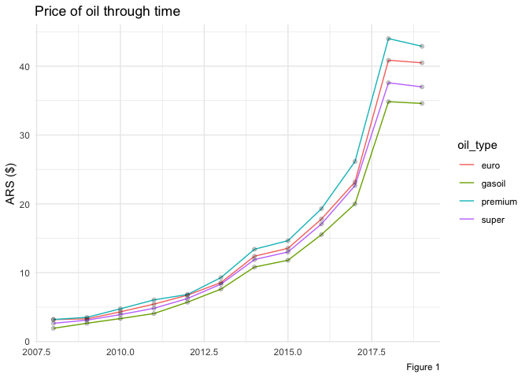

-   [Objective](#objective)
-   [Joining the traffic dataset with the oil dataset](#joining-the-traffic-dataset-with-the-oil-dataset)
-   [Exploratory analysis of the oil prices dataset](#exploratory-analysis-of-the-oil-prices-dataset)

### Objective

This project consists on estimating time-spent by drivers on AUSA toll booths in Buenos Aires highways. Currently users of these highways experience excessive amount of time waiting to go through toll booths on peak hours. In addition to estimating this metric, an analysis of whether contextual variables like toll-booth fee or oil prices have an impact on the behavior and amount of users commuting through these highways.

### Joining the traffic dataset with the oil dataset

The `traffic.csv` dataset previously analized [here](https://github.com/tulians/traffic/tree/master/descriptive) has a file size of approximately 562MB, while the `oil_prices.csv` dataset is only 11.2KB. We'll be merging both files in an inner join fashion, using the year and month columns via the [`merge()`](https://www.rdocumentation.org/packages/base/versions/3.6.0/topics/merge) function. As a result of this merge each existing row in `traffic.csv` will be repeated 4 times, one per each oil type, thus taking the final, merged, dataset to an approximate size of 2.2GB.

R requires that variables are stored in RAM in its entirety, so managing a dataframe this big could be imposible for some machines if no alternate processing is performed. For this reason is that the [`ff`](https://cran.r-project.org/web/packages/ff/index.html) package will be used.

### Exploratory analysis of the oil prices dataset

The oil prices dataset consists of monthly prices of different types of oil: super, premium, gasoil, and euro. The four of them experienced a steady increase since 2008 until 2018, which is illustrated in Figure 1.

